# 视觉与交互检查 · 2026-09-08

## 最新补充：桌面线缆与一键启动

- 鼠标线确有穿桌：桌面高度 0.750 m，修改前网格最低点 0.740425 m，74 个顶点低于桌面。原因是自动贝塞尔手柄在连接抬高的主机端口时向下过冲。保留平面曲线，把贴桌线段的高度切线设为水平，并调整走线避开鼠标垫边缘和软盘。
- 修改后鼠标线最低点 0.750480 m；耳机线最低点 0.750442 m，两者均无顶点穿桌，鼠标线也未穿过鼠标垫。耳机线原先没有穿桌，但较细且末端没有插头，现略增粗并补上落在桌面的 3.5 mm 插头，使末端更容易辨认。
- 在可见 Blender 场景中更新、保存并导出，当前源场景 561 个对象。浏览器使用最终 GLB，实际查看相同近景的前后截图及贴近桌面的低角度截图；未调整房间照明。
- 比较条件：Chromium，1600 × 1000，DPR 1，曝光 1.10。Three.js 相机 `(.91,1.04,.86)`、目标 `(.47,.756,.18)`、FOV 38°。低角度相机 `(.91,.815,.59)`、目标 `(.42,.757,.10)`、FOV 37°。检查后恢复正常页面。
- 根目录新增 `启动体验.cmd` 和 `scripts/start-experience.ps1`。已验证复用现有服务、不重复启动；隔离端口和含中文、空格的路径可从未运行状态启动；被其他应用占用时提示失败且不结束对方进程。用户正在使用的 1994 服务未被中断。
- 最终 GLB 导出后的生产构建通过，保留既有大 JS chunk 提示。本轮只修改模型与启动方式，没有改动 DOS 或游戏逻辑。

| 修改前 | 修改后 |
| --- | --- |
| 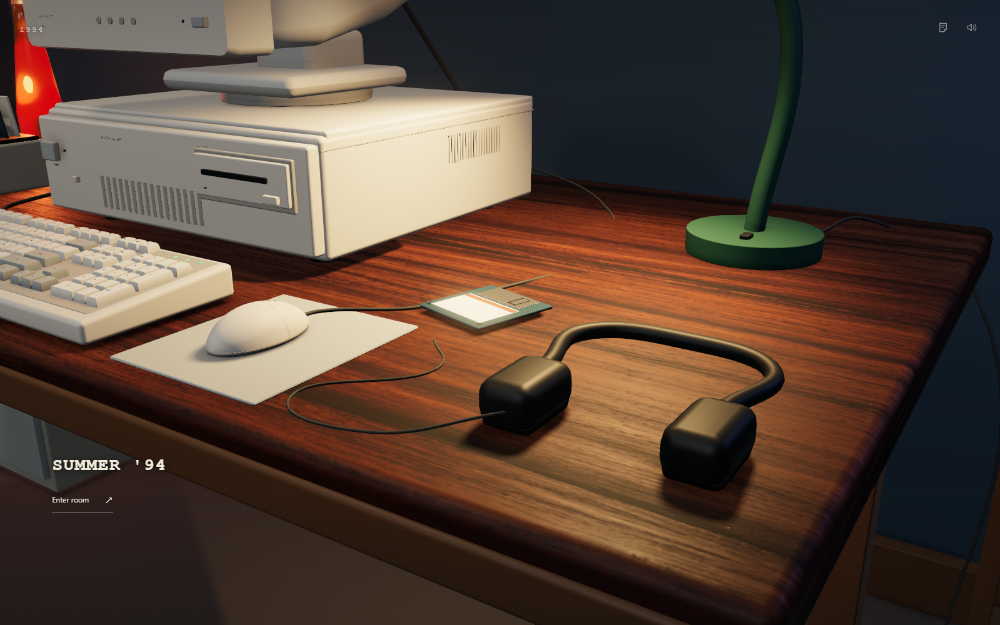 |  |

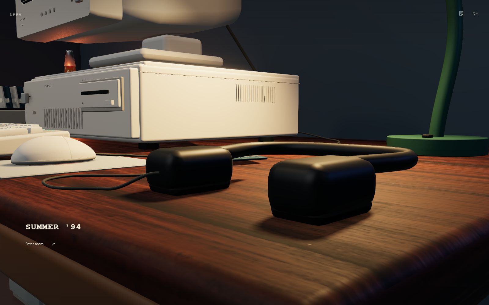

## 游戏音乐、根目录彩蛋与隐藏贴纸

- 用户补充要求：游玩时有 8 位机风格电子音乐；彩蛋无需深入文件夹，C 根目录 DIR 可见，一条命令打开；把两条命令做成桌面上的朋友手写留言。
- 原创配乐 **Midnight Courier**，140 BPM / 16 小节，脉冲主旋律、三角波贝斯、琶音和芯片鼓点。浏览器实际 OfflineAudioContext 合成：27.4285625 秒、双声道、32 kHz、峰值 0.60000002、RMS 0.08585，全部样本有限，首尾归零。AudioBufferSource 连续循环，不依赖 JavaScript 定时器逐音符播放。
- `work/music-check.js` 实测主输出存在音频信号，静音后归零、取消静音恢复，且仍为同一个播放源；结束本局、关机停止，重新开局重新播放。异步合成后不能复活已停止音乐，重复状态不叠加源，dispose 清理通过。完整过程无浏览器 pageerror。
- `C:\` 根目录新增 `MOON.GIF`、`GARAGE.GIF`、`VIEW.EXE`、`PHOTOS.TXT`，旧同名文件、成绩、历史 `GAMES\BONUS` 目录不覆盖。`work/easter-check.js` 已验证开机后的 DIR 列出两图；两条 VIEW 命令分别就绪，Esc 返回 C 根目录，文件与成绩未变。11 项 DOS 测试通过。
- 新增 `Secret_Note` 实体纸张，170 × 100 mm，位于左侧软盘盒边缘，手写蓝字、浅绿色纸面。第一摆放点被软盘盒从坐姿镜头完全挡住，已向桌前移至 Blender `(-.66,-.225,.7505)`，留下可发现的一小块纸面；点击纸张而非代理按钮可以打开阅读。
- 手写纸条 UI 平时隐藏，没有新增工具栏入口。相机沿用实际坐姿镜头，1600 × 1000、DPR 1、FOV 42°、曝光 1.10，未改变房间灯光。`work/secret-note-check.js` 验证实体点击、Esc 与关闭按钮；1280 × 720 桌面视口中两条命令完整可见。
- Blender 可见场景已保存并导出；最后的生产构建通过，保留既有大 JS chunk 提示。

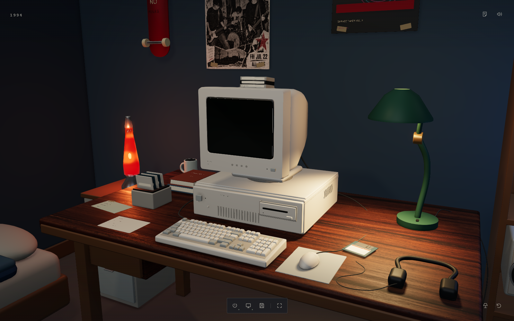

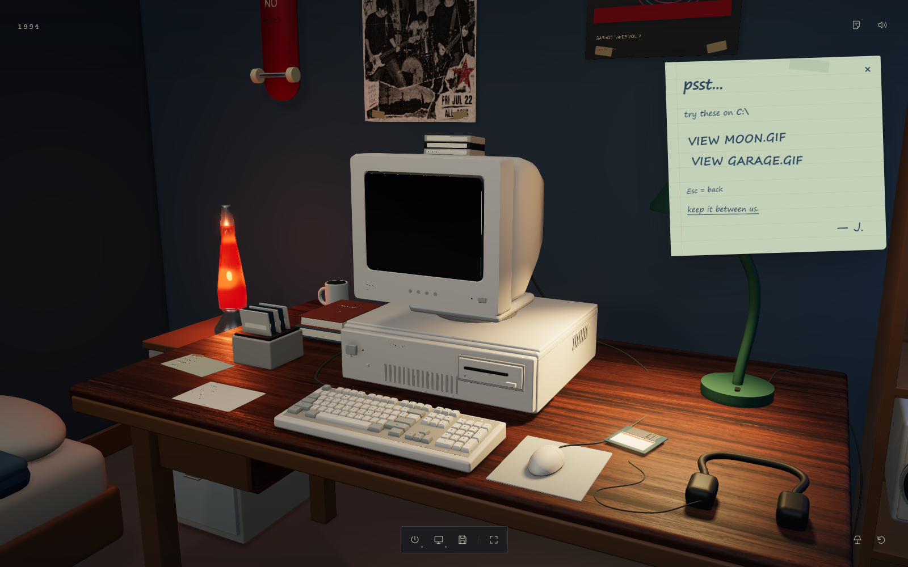

---

## 本轮：室内摇滚少年房间

用户要求取消百叶窗、室外光与大面积中文 UI，参考两张美式少年卧室图，整体偏摇滚；同时修正键位、简化鼠标外壳、保留原游戏退出逻辑，在 C 盘增加两张可探索的图像。参考图只用于陈设与氛围，未抽取水印或素材像素。

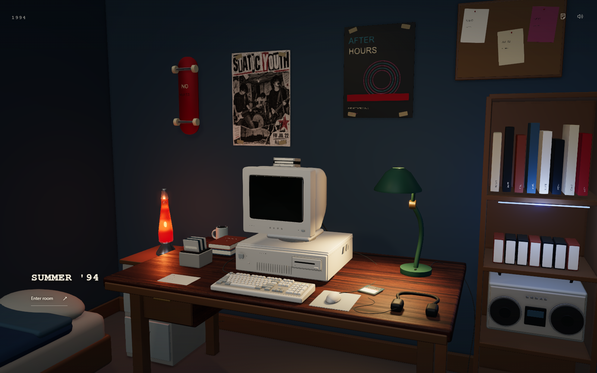

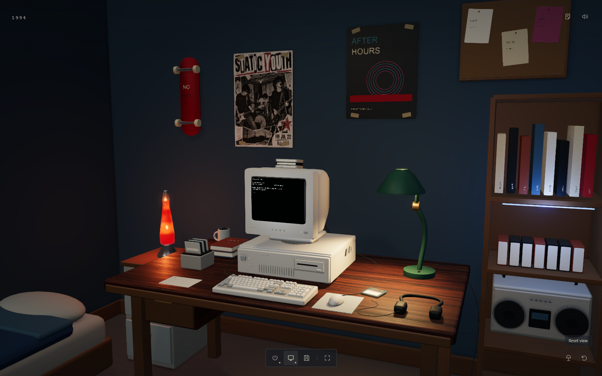

### 比较条件与迭代

本轮房间对照为 Chromium 实时截图，1600 × 1000，DPR 1，垂直 FOV 42°，ACES exposure 1.10。Three.js 相机位置 `(0.938819, 1.505565, 2.258109)`，目标 `(0.01, 1.18, -0.04)`。入口相机较首版后退，以纳入床沿和书架；不能把旧日光入口与新版作像素差分。熔岩灯的球体有约 6 mm 缓慢运动，对照未锁定动画时间。

| 指令 | 实际调整与结果 |
| --- | --- |
| 移除错误的窗墙关系 | 完成：移除窗、百叶窗和日光，左侧改为完整墙面；Blender 核查无残留窗框/百叶对象 |
| 摇滚少年卧室 | 完成：深蓝墙、原创 Static Youth 印刷海报、演出海报、滑板、熔岩灯、床、书架、磁带音响与耳机；主要操作设备仍在原位置 |
| 夜间室内光 | 完成：试版冷补光过平，环境反射强度 .15 → .10、冷补光 1.15 → .55，顶灯 2.0 冷色 → 1.35 暖色；保留台灯主光，熔岩灯局部光 .72 → .28，减少过曝 |
| 键帽接回键盘 | 完成：101 键共用倾斜底板，键帽裙边埋入键床，独立长 Enter/+ 与宽 0；补四只落在桌面的胶脚 |
| 键面字形 | 完成：同一近景看出小号 Arial 笔画只剩几个像素，局部增大为 .0055 / .0035 并改粗体，不通过抬高文字制造悬浮 |
| 鼠标侧面 | 完成：原层叠块改为连续曲面两键外壳，宽 60 mm、长 106 mm，检查侧面及按键方向；补底面滑垫 |
| 显示器顶部接触 | 完成：散热条贴合后壳坡度并避开圆肩，磁带按相同坡度堆叠 |
| 精简 UI 与纸条 | 完成：移除大标题卡、任务进度与常规教学通知；图标提供英文悬停/焦点名称，返回房间保留文字；纸条改为朋友口吻与歪斜手写 |

房间灯光前后使用相同镜头；后图同时包含散热条/磁带接触修正：

| 试版 | 收暗并校正暖光后 |
| --- | --- |
| 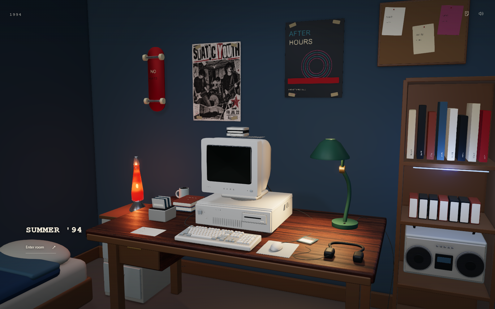 |  |

键盘字形前后使用同一相机 `(0.08, 1.10, 0.71)`、目标 `(0, .79, .35)`、FOV 44°。后图同时采用最终暖光，因此不把颜色差别归因于字形。

| 调整前 | 调整后 |
| --- | --- |
| 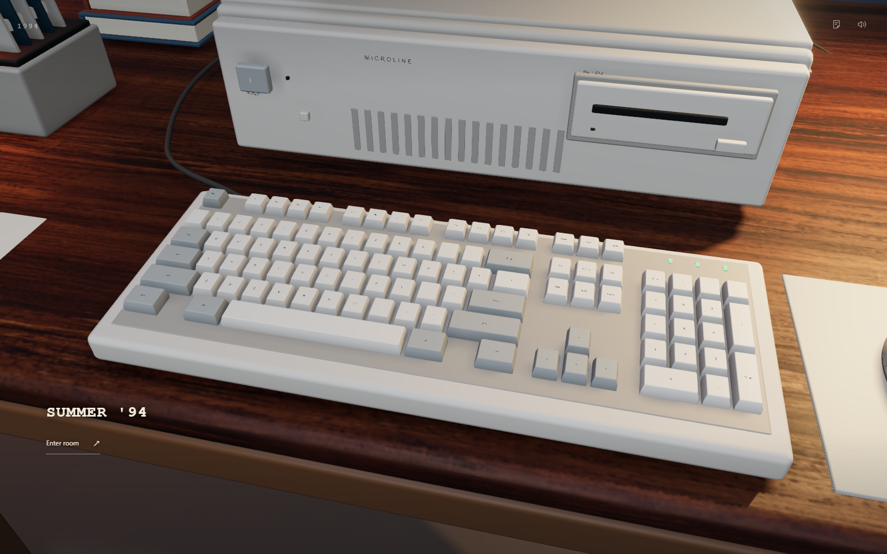 | 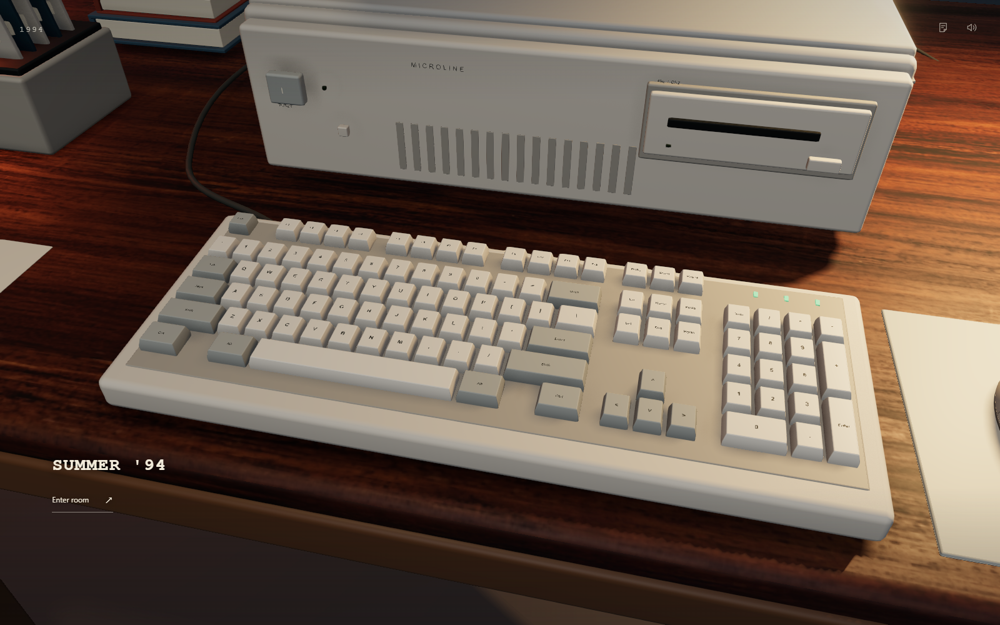 |

鼠标侧面：相机 `(.56,.805,.39)`，目标 `(.329,.775,.35)`，FOV 30°；前方按键视角为 `(.50,.88,.16)`。这些是诊断近景，拍摄后恢复正常镜头。

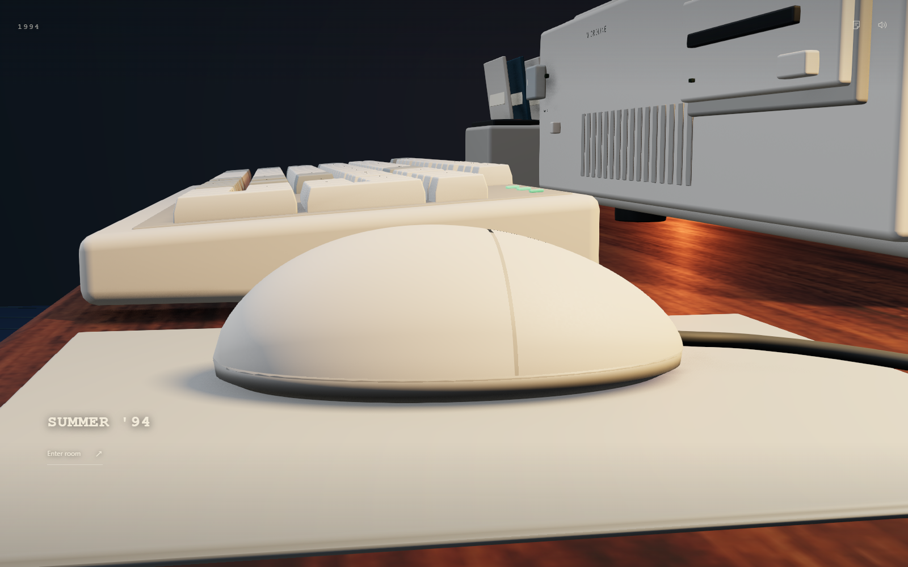

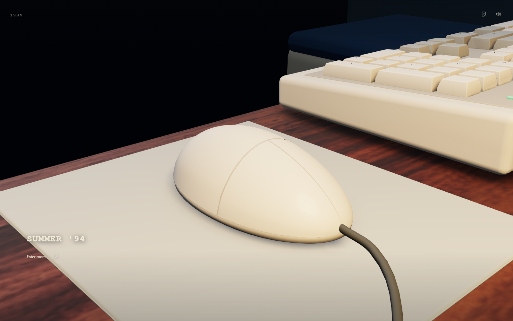

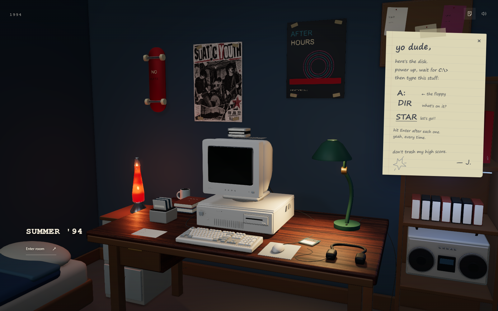

### 本轮验证

- Blender 可见窗口中完成建模、整场重建、重复细节阶段和导出。最终 551 个源对象、101 个键帽、4 个键盘胶脚；海报只有 1 个图像节点。GLB 7,595,568 bytes、126,325 triangles。源文件和图像材质已保存打包。
- 独立 Playwright 会话执行实体主机/显示器/台灯/纸条/软盘点击、A: → DIR → STAR、游戏输入、保存、Esc 返回 DOS、Back to room 返回房间、带盘启动错误与退盘恢复、刷新恢复成绩，全部通过。没有操作玩家正在使用的浏览器会话或清空其存档。
- 回归发现插盘动画起始帧偶发负时间进度，导致轨迹数组下标为负；进度限制到 [0, 1]。再次完整回归记录 `pageErrors: []`。图标伪元素造成的重复无障碍名称也已通过显式 aria-label 修正。
- 彩蛋通过真实键盘 CD/DIR/TYPE 探索、分别用 VIEW / VIEW.EXE 打开，两张本地图像均 ready，尺寸 1448 × 1086。实际屏幕截图已检查；Esc 恢复原目录和键盘输入，探索前后的全部盘文件与成绩一致。玩家 UI 不直接给出藏身路径。
- 11 项 DOS 单元测试通过，包含错误图片、异步加载晚返回、旧盘升级保留文件、查看器输入恢复。最终生产构建通过；仍有 Three.js 主包超过 500 kB 的构建提示（JS 1,004 kB / gzip 324 kB）。
- 最终模型导出后再次实际开机并检查入口及房间画面。NVIDIA RTX 4060 Laptop、Chromium headless / ANGLE D3D11、1600 × 1000、DPR 1 的 180 个 RAF 样本，中位间隔 4.3 ms、P95 8.4 ms；这只是本机无头浏览器短时调度采样，不是可见窗口帧率或其他设备性能保证。

边界：床品、书脊和部分道具仍是较简化的形体，表面老化和纸面细节还有后续空间。网页使用 PBR、室内环境反射、实时阴影、GTAO、轻微 bloom，未加入烘焙全局光照或网页路径追踪。Blender Cycles 预览与网页是两种渲染器，不能用离线效果替代实际网页验收。原退出逻辑保持不变，本轮不开发手机版。

---

## 首版记录（历史日光版本）

视觉目标是 1994 年的米白色卧式 486、独立 CRT、真实尺寸的 3.5 寸软盘，以及窗光与绿台灯照亮的木桌。电脑为原创 MICROLINE 外形，年代比例参考 [Centre for Computing History 的 Prolinea 展品](https://www.computinghistory.org.uk/cgi-bin/sitewise.pl?act=det&p=7799)，不是某个品牌型号的精确复刻。

## 实际画面

以下均为应用实时画面，未使用离线图替换网页场景。

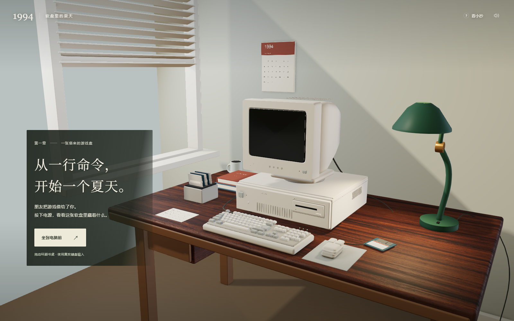

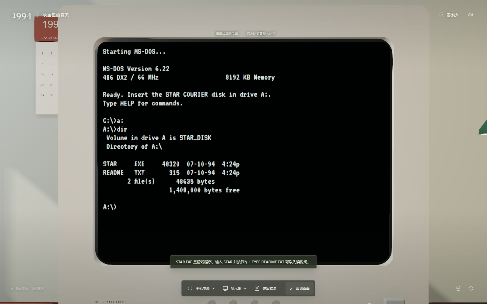

## 修改前后

同一 1600 × 1000 视口、同一屏幕近景镜头。游戏时间与物体位置不同，不作逐像素差分；比较目标是屏幕边界与字形。

| 修改前 | 修改后 |
| --- | --- |
| 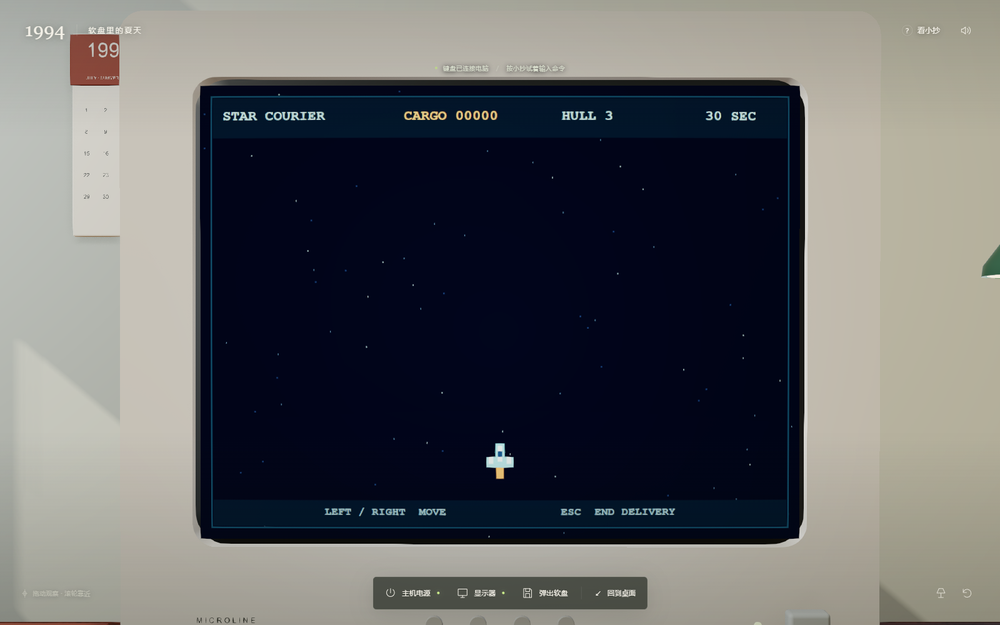 | 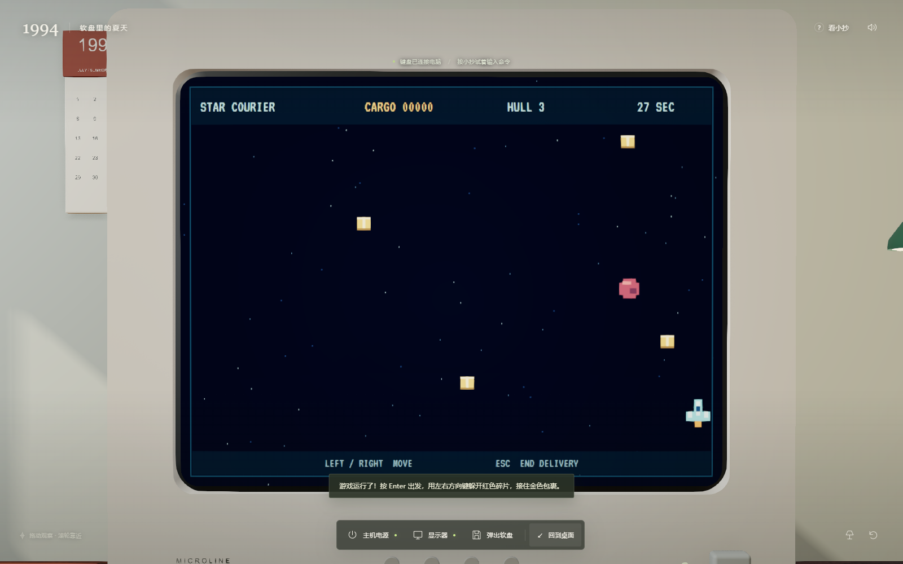 |

- 原来的矩形屏幕四角穿过圆角内框，改为匹配开口的弧形网格，修正边框与灯罩法线。
- 缩小 CRT 外壳圆角，保留注塑外壳厚度、通风槽、开关和独立底座。
- 去掉遮住文字的中心高光；VT323 替换 Courier，保持命令列宽。该字体不是精确 IBM VGA 字库。
- 木纹使用物理尺度 UV，减弱暖色乘色与厚漆高光；台灯强度从 2.3 降为 1.5，窗影 VSM 模糊半径从 4 调至 8。
- 增加 GTAO 接触阴影、SMAA 抗锯齿、ABS 粗糙度变化；隐藏交互代理不参加深度与遮蔽渲染。

## 检查结果

| 项目 | 结果 |
| --- | --- |
| 桌面整体、左前观察、屏幕近景 | 查看实际截图；核心设备轮廓完整，屏幕没有原先的突出角片 |
| 开关、台灯与命令小抄 | 通过实际画布点击主机按钮、显示器按钮、台灯开关、桌面纸条 |
| 软盘与命令 | 实体点击插盘，执行 A: → DIR → STAR，屏幕显示与文件状态一致 |
| 游戏与存储 | 键盘移动、结束本轮、输入 TST、写入 A:\SCORES.DAT、刷新恢复均通过 |
| 启动错误恢复 | 插着数据盘重启，出现 Non-System disk；退盘按键后恢复 DOS |
| 控制台与构建 | 最终 Chromium 会话 0 errors / 0 warnings；7 项 DOS 测试通过；生产构建通过 |
| 可重建性 | 独立目录中全新构建、重复阶段、重复完整构建和重复导出均通过，无对象数量增长 |

本机 NVIDIA RTX 4060 Laptop、Chromium/ANGLE D3D11、1600 × 1000，180 个 requestAnimationFrame 样本：中位间隔 8.5 ms，P95 12.6 ms。这是短时本机观测，不代表其他设备、后台页面或持续负载的帧率保证。

## 当前边界

本版是面向桌面浏览器、鼠标和实体键盘的可玩第一章，不开发手机版。DOS 是行为模拟，游戏是项目原创，没有真实 BIOS/MS-DOS 镜像或通用 EXE 兼容。浏览器使用 PBR、环境反射、实时阴影和屏幕空间遮蔽；没有路径追踪或烘焙全局光照。窗外、墙面与表面老化细节仍较简化，尚不等同于摄影级画面。首包 Three.js 与后处理约 998 kB（gzip 323 kB），构建器仍有大 chunk 提示。
